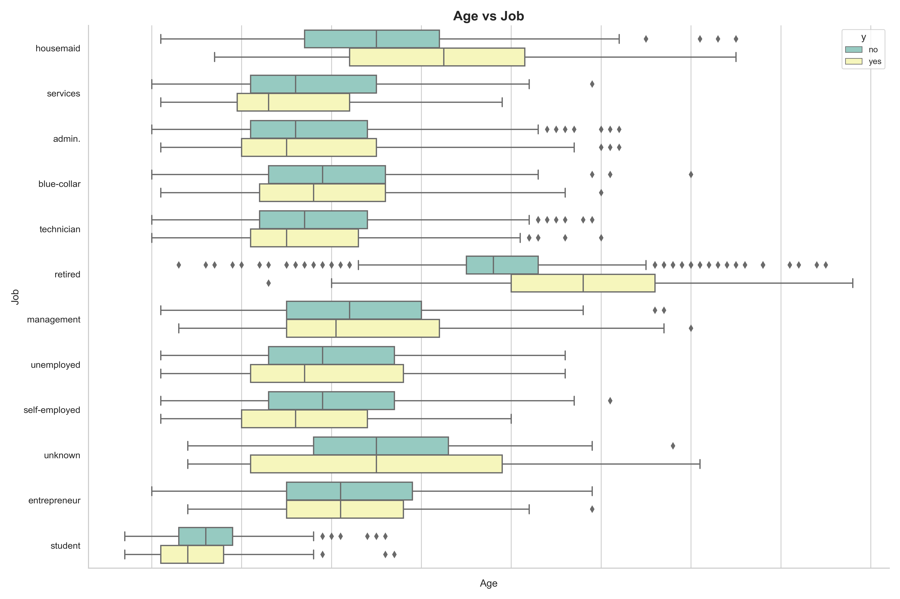
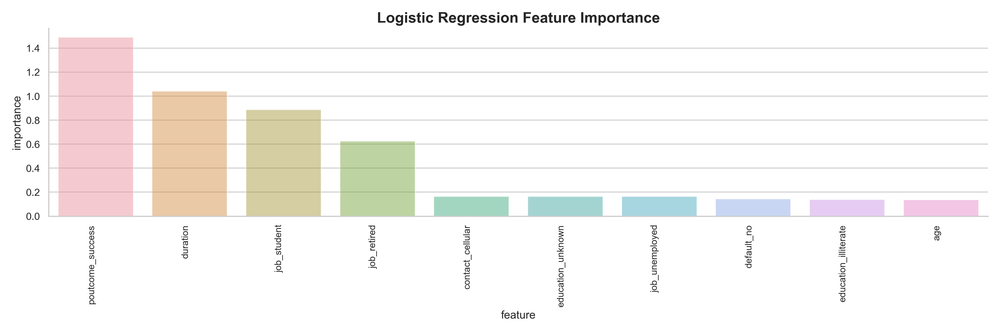
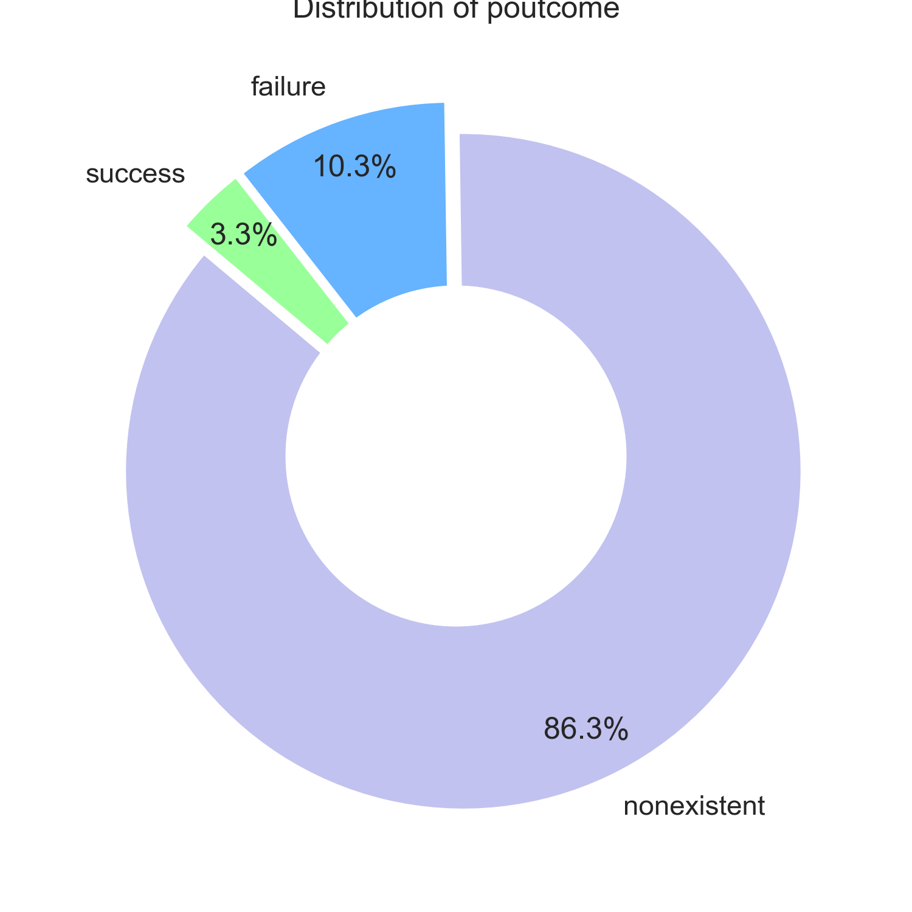

# Bank Marketing

**Context**

Our dataset comes from the UCI Machine Learning repository [link](https://archive.ics.uci.edu/ml/datasets/bank+marketing).  The data is from a Portugese banking institution and is a collection of the results of multiple marketing campaigns.  We will make use of the article accompanying the dataset [here](CRISP-DM-BANK.pdf) for more information on the data and features.

**Disclaimer**

This is a summary of my analysis, findings, and recommendations. The full analysis can be found [here](prompt.ipynb).


### Business Understanding

**Business Objectives:**

The business goal is to find a model that can explain success of a contact, i.e. if the client subscribes the deposit.


### Data Problem Definition

Understand the key features that drive the success of a contact. In order to do that, a univariate and multivariate analysis can be made on the given dataset (the campaign database) to create and train a model that can accurately (hopefully) predict the success of a contact.


### Data Description

The dataset contains the following columns:

#### bank client data:
```
1 - age (numeric)
2 - job : type of job (categorical: 'admin.','blue-collar','entrepreneur','housemaid','management','retired','self-employed','services','student','technician','unemployed','unknown')
3 - marital : marital status (categorical: 'divorced','married','single','unknown'; note: 'divorced' means divorced or widowed)
4 - education (categorical: 'basic.4y','basic.6y','basic.9y','high.school','illiterate','professional.course','university.degree','unknown')
5 - default: has credit in default? (categorical: 'no','yes','unknown')
6 - housing: has housing loan? (categorical: 'no','yes','unknown')
7 - loan: has personal loan? (categorical: 'no','yes','unknown')
```
#### related with the last contact of the current campaign:
```
8 - contact: contact communication type (categorical: 'cellular','telephone')
9 - month: last contact month of year (categorical: 'jan', 'feb', 'mar', ..., 'nov', 'dec')
10 - day_of_week: last contact day of the week (categorical: 'mon','tue','wed','thu','fri')
11 - duration: last contact duration, in seconds (numeric). Important note: this attribute highly affects the output target (e.g., if duration=0 then y='no'). Yet, the duration is not known before a call is performed. Also, after the end of the call y is obviously known. Thus, this input should only be included for benchmark purposes and should be discarded if the intention is to have a realistic predictive model.
```
#### other attributes:
```
12 - campaign: number of contacts performed during this campaign and for this client (numeric, includes last contact)
13 - pdays: number of days that passed by after the client was last contacted from a previous campaign (numeric; 999 means client was not previously contacted)
14 - previous: number of contacts performed before this campaign and for this client (numeric)
15 - poutcome: outcome of the previous marketing campaign (categorical: 'failure','nonexistent','success')
```
#### social and economic context attributes
```
16 - emp.var.rate: employment variation rate - quarterly indicator (numeric)
17 - cons.price.idx: consumer price index - monthly indicator (numeric)
18 - cons.conf.idx: consumer confidence index - monthly indicator (numeric)
19 - euribor3m: euribor 3 month rate - daily indicator (numeric)
20 - nr.employed: number of employees - quarterly indicator (numeric)
```

#### output variable (desired target):
```
21 - y - has the client subscribed a term deposit? (binary: 'yes','no')
```

## I. Initial Analysis

#### 1. Who's subscribing to the deposits?

When looking at the demographics in the dataset, retired people around their 70s are good potential clients.



There's a consistent pattern across the entire database that a longer call can be lead to sucess.


While most of the depositers work in administration jobs, the higher sucess rates are coming from retired and students.


## II. Hypotesis

$\color{green}{Hypothesis}$ 
- If the client is studying or retired, the chances of success increase considerably.
- If poutcome is successful, the outcome of Y most likely will be a 'yes'

## III. Predictive Model 

#### 1. Data input

After several iterations, feature engineering, and fine-tunning the approach, a few models were built and optimized taking into consideration the following characteristics:

```
 #   Column   
---  ------   
 0   age      
 1   duration 
 2   campaign 
 3   job      
 4   marital  
 5   education
 6   default  
 7   housing  
 8   loan     
 9   contact  
 10  day_of_week 
 11  poutcome    
 12  y           
```

Just some of the data was used to train the model. A portion of the data (20% of the records) was saved for testing purposes to measure the accuracy of the models. 

#### 2. Model design

A few of models (KNN, Logistic Regresion and others) were used to predict the campaign success. Details on them can be found [here](prompt.ipynb).

#### 3. Model results

The Logistic Regression model, with an accuracy of `0.908352` turned out to the best model. This model gave the following results:


$\color{orange}{Analysis}$

- The model is pretty good to predict if a negative outcome will happen.
- The model tends to be a pesimistic one since sometimes would predict a negative outcome when in fact the client would subscribe.
- Chances that the model predicts a positive outcome incorrectly are low which is pretty good.


## IV. Evaluation

The predictive model was analyzed to understand what factors were more important to predict the outcome of the campaign. The results are the following:




$\color{red}{Conclusion}$
The hypothesis is confirmed, when poutcome is sucessful, there's a pretty good chance the value of **Y** will be 'yes'. Duration is also a feature with good predicting value.


## V. Next Steps & Recommendations

### Recommendations

**Concentrate on the campaign outcome**: Since previous outcomes are a clear sucess factor, it's clearly important to try to execute to its conclusion. If it's successful, it will most likely lead to positive outcomes. 

**Widen the scope of marketing campaing**: Increasing the previous outcome sucess rate could drive meaningful positive outcomes.

**Explore designing  "retargeting" campaings (RT campaigns for short)**. RT Campaigns are designed for clients that are already aware of your product (via a previous campaign). The goal of RT campaigns is to increase LTV on already engaged clients.



### Next Steps
**Dig deeper into the models database**: There's still some other features that haven't been investigated. Specially the ones realted to "social and economic context attributes" could also provide insights to improving the campaign predictibility.
